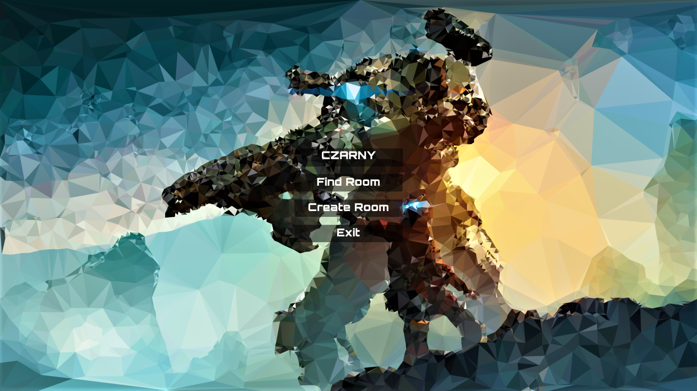
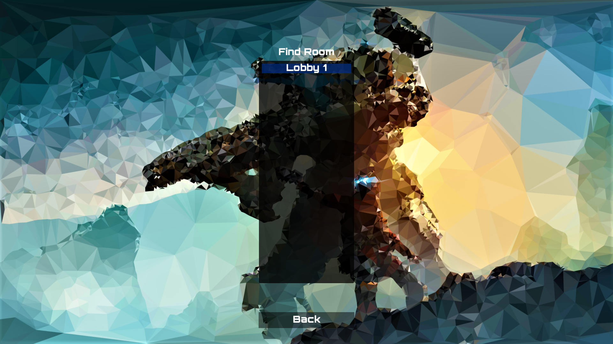
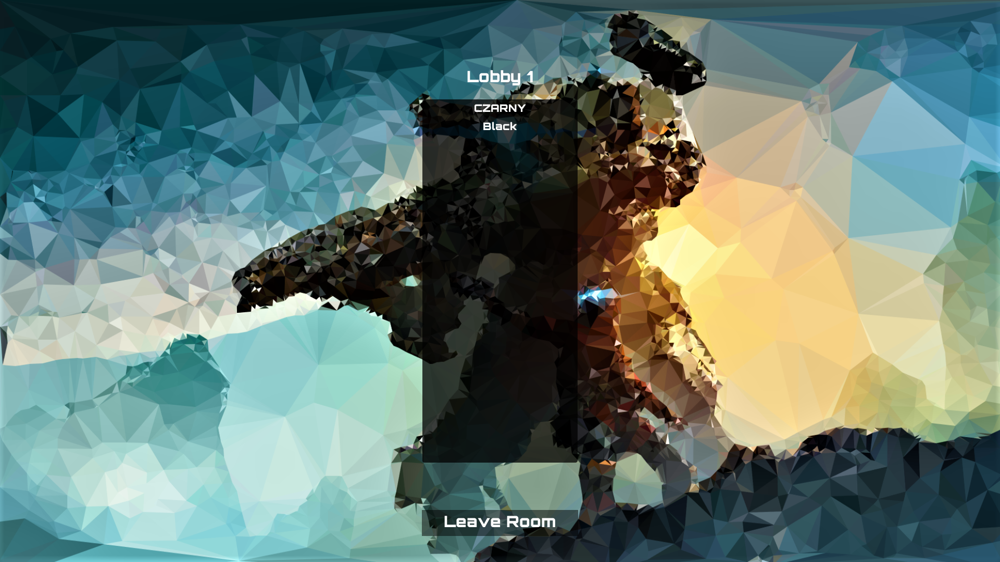
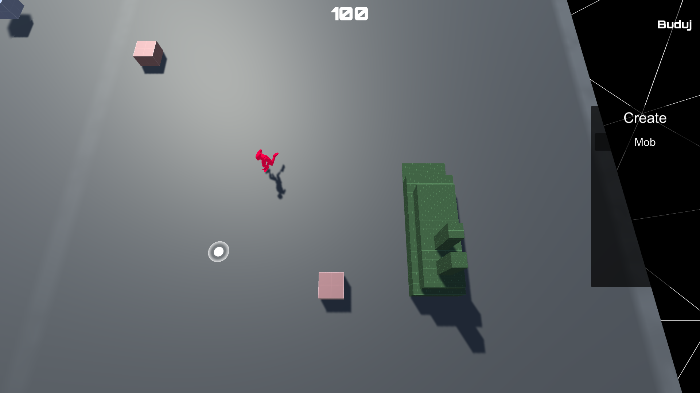

# -Isometric-view-multi
Hello :wave: 
I am testing Pun 2 on my project, which is based on an old game called "Parkan: Iron Strategy", in a project mainly focused on multiplayer. 
Below are some screens. 
 
 

 

 

 

 
