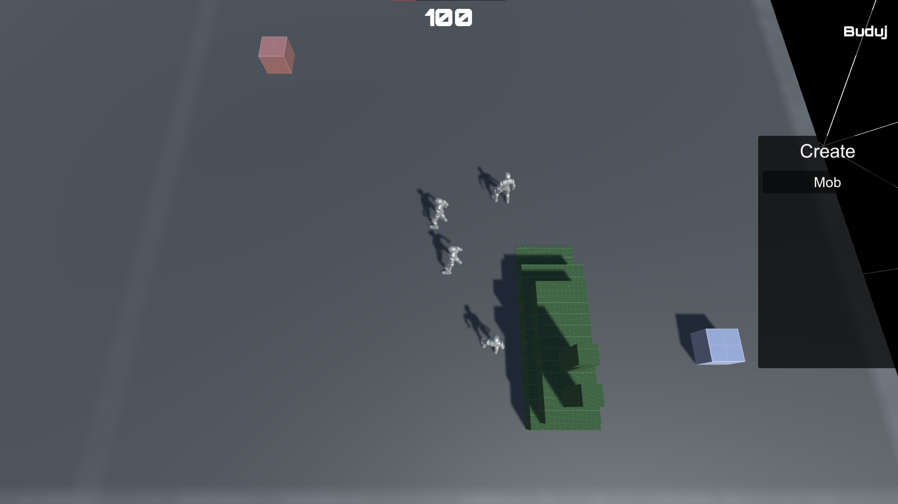
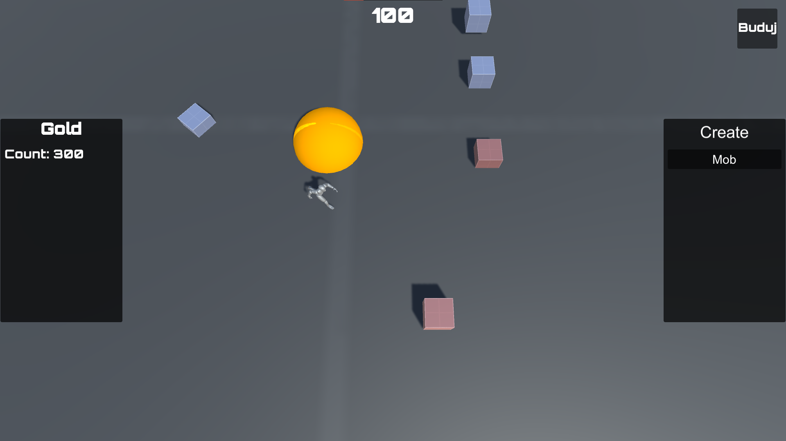

# -Isometric-view-multi
Hello :wave: 
I am testing Pun 2 on my project, which is based on an old game called "Parkan: Iron Strategy", in the project I mainly focus on multiplayer game. 
Below are some screens. 
 

  The game has a menu where you enter your nickname and then choose whether you want to join another player's room or create your own. 
   

  This is what the menu looks like when you create a room, give a name and confirm.
   

  This is the menu from the side of the player who wants to join the room.
   

  and finally we have a room with a list of players, only the room creator has a button to start the game. 
   

# In Game
The game has some basic mechanics like moving the camera, marking your mobs and moving them, interacting with your base where you can create more mobs, and interacting with materials. After interacting with a material, the mob automatically starts running from the raw material ( it waits a while to extract it) to the base to put down the raw material.

   

   

   

